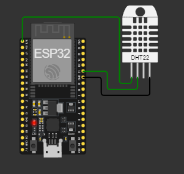
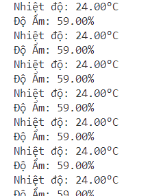
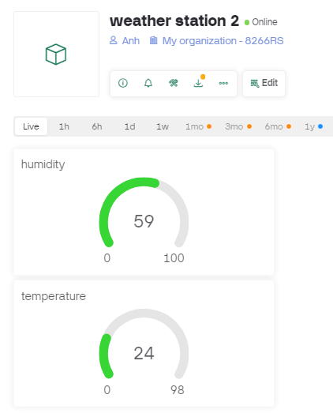

# Weather-Station-Blynk-ESP32

An IoT-based weather station that collects real-time data (temperature, humidity) and syncs with Blynk for remote monitoring via a mobile app.

## Features
- Measures **temperature** and **humidity** using DHT22 sensor.
- Uses **ESP32** for data processing and WiFi communication.
- Sends data to **Blynk** for remote monitoring.
- Displays data on **Blynk app** and **Serial Monitor**.

## Circuit Diagram
Below is the schematic of the weather station setup:



## Serial Monitor Output
Real-time data displayed on the ESP32 Serial Monitor:



## Blynk App Display
Live temperature and humidity readings on the Blynk app:



## Requirements
- ESP32 board
- DHT22 temperature and humidity sensor
- Blynk mobile app
- WiFi connection

## Installation
1. **Clone this repository**:
   ```bash
   git clone https://github.com/Hung000anh/Weather-Station-Blynk-ESP32.git
   ```
2. **Install dependencies**:
   - Install **Blynk** and **DHT** libraries in Arduino IDE.
   - Set up Blynk with Virtual Pins **V0** (humidity) and **V1** (temperature).
3. **Flash the ESP32**:
   - Upload the provided code to ESP32 using Arduino IDE.
4. **Monitor data**:
   - Open **Serial Monitor** to check real-time data.
   - Open **Blynk App** to view readings remotely.

## License
This project is licensed under the MIT License.

